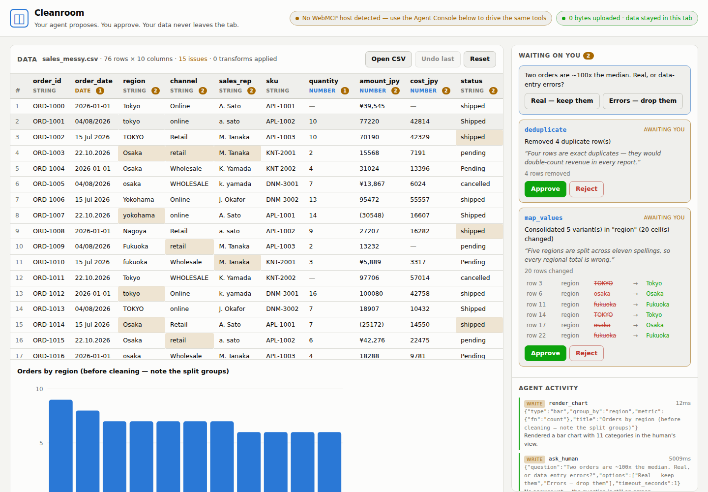

# Cleanroom

**Data cleaning your agent can do, but only you can approve — and your data never leaves the browser tab.**

Built for the [OpenAI WebMCP Challenge](https://webmcp.devpost.com/).

**▶ [Try it live](https://cleanroom-80s.pages.dev)** · **[Watch the 2-minute demo](https://youtu.be/bsP4PRU1EFk)**

No install, no sign-up, no backend. Your CSV is parsed in the tab and never uploaded.



---

## The problem

Every analyst has the same bad afternoon: a CSV lands in your inbox, and before you can answer
a single question you have to fix it. Regions spelled five ways. Amounts stored as `¥39,545`.
Four date formats in one column. Duplicate rows that silently double your revenue.

An LLM is *very* good at spotting exactly these problems. But handing it your data means one of two things:

1. **Upload it** to a server, a notebook kernel, or a code interpreter — which is a non-starter the
   moment the file contains customer names, salaries, patient records, or anything your compliance
   team has an opinion about; or
2. **Paste a sample** and hand-apply the model's suggestions yourself — losing the automation you
   wanted in the first place.

Cleanroom is the third option. The agent gets *tools*, not your data.

## What Cleanroom does

Drop a CSV on the page. Nothing is uploaded — there is no server to upload it to. The page then
registers **14 WebMCP tools** that let an agent in the browser profile the data, find concrete
problems, query and aggregate it, chart it, and **propose** fixes.

The word *propose* is the whole design:

> **Reads are free. Writes are proposals.**
> No tool mutates the table. A mutating tool computes the exact before/after diff, puts a card in
> front of the human, and stops. Only a human click applies it.

So the agent can say *"five regions are split across eleven spellings, so every regional total is
wrong"* and stage the fix — and you see the twenty specific cells that would change before anything
happens. `undo` is deliberately **not** exposed as a tool. Walking a change back belongs to the person.

## Why this needs WebMCP specifically

This is not a server-side MCP with a web page bolted on. It could not be one.

| | Server MCP | Cleanroom (WebMCP) |
|---|---|---|
| Where the data lives | uploaded to a server | in the tab, in a JS object |
| What the agent receives | your rows | tool results computed over your rows |
| Auth | API keys, OAuth, a backend | none — it's already your browser |
| The human's role | reads a summary afterwards | approves each change, in the same view |
| Cost to run | per-seat infrastructure | a static file |

The agent and the human are looking at **literally the same object**. `store.js` is the single source
of truth; `ui.js` renders it and `tools.js` operates on it. When the agent proposes something, the card
appears in the human's rail in the same tick. There is no sync, no polling, no second copy that can drift.
That shared-state property is what a browser-resident agent gets that a remote one structurally cannot.

## The privacy receipt

The central claim is "your data never leaves this tab," and a claim is worth nothing. So the page
instruments `fetch`, `XMLHttpRequest`, `sendBeacon` and `WebSocket` at startup, before any other module
loads, and counts every outbound request. The counter is in the header, and the agent can read it too:

```
> get_privacy_receipt
0 outbound request(s), 0 byte(s) of data sent since load.
```

It reads zero because there is nothing to send it to. No analytics, no CDN, no webfont, no charting
library — the sample dataset is inlined as a string rather than fetched, precisely so the ledger stays
honest. **Being straight about the limits:** this counts requests *the page* makes. It cannot police the
browser itself or a malicious extension, and it is not a substitute for a security review.

## The 14 tools

**Reads** (`readOnlyHint: true`, run immediately)

| Tool | What it gives the agent |
|---|---|
| `get_dataset_overview` | Shape, per-column inferred type and blank count, transforms applied, proposals pending |
| `profile_column` | Type, missing %, distinct count, samples; quartiles/sum for numbers, date range and *formats present* for dates, top-10 for text |
| `detect_issues` | Duplicate rows, blanks, whitespace, numbers-as-text, mixed date formats, IQR outliers, near-duplicate categories |
| `query_rows` | Filter / sort / project / page, hard-capped at 200 rows |
| `aggregate` | group-by with count, sum, avg, min, max, distinct |
| `list_proposals` | What was proposed and what the human decided |
| `get_change_log` | The ordered list of applied transforms — provenance for the report |
| `get_privacy_receipt` | The outbound-network ledger |

**Human-gated writes** (stage a diff and stop)

| Tool | What happens |
|---|---|
| `propose_transform` | 15 operations; computes the diff, queues an approval card, returns `pending_human_approval` |
| `await_decision` | Blocks until the human clicks, then reports approved / rejected |
| `ask_human` | Puts a question card in the page for judgement calls, and waits for the answer |
| `render_chart` | Draws an SVG chart into the human's view |
| `write_report` | Publishes a markdown findings report beside the data |
| `prepare_export` | Builds the cleaned CSV in-tab and offers the human a download button |

### Three details that made the agent much better at this

1. **Every detected issue carries a `suggested_fix`** — a ready-to-use `propose_transform` payload.
   The agent goes from "what's wrong?" to a queued, reviewable fix in one hop instead of guessing at
   an API shape. This single change cut the model's flailing more than anything else.
2. **Errors are instructions.** Every failure names the valid inputs — `Column "reigon" does not exist.
   Available columns: order_id, order_date, region, …` — and is returned as text rather than thrown,
   so the agent reads the recovery path instead of hitting an opaque host error.
3. **Results are context-window shaped.** Profiles and aggregates are summaries by construction. Raw
   rows come back only when explicitly requested, and are capped. A 100k-row file is fully workable
   without a single row entering the model's context.

## Try it

**Live:** <https://cleanroom-80s.pages.dev>  
**Demo video:** <https://youtu.be/bsP4PRU1EFk>

- In **ChatGPT's browser** or **Chrome with WebMCP enabled** (`chrome://flags/#enable-webmcp-testing`),
  open the page and the header shows *"Agent connected · 14 tools"*. Then just ask.
- In **any other browser**, the page still works: the built-in **Agent Console** calls the *same registered
  tool objects* a host calls. It is an inspector, not a mock — if it runs there it runs in ChatGPT.

Prompts worth trying:

> *"What's wrong with this data? Don't change anything yet — just tell me what you'd fix and why."*

> *"Clean it up. Propose each fix separately so I can review them, and ask me before you touch anything
> that's a judgement call."*

> *"Now show me revenue by region and by month, and write up what you changed."*

## Running locally

```bash
git clone <this repo>
cd cleanroom
python3 -m http.server 8000     # any static server; there is no build step
open http://localhost:8000
```

Tests (real Chromium via Playwright, 32 assertions covering every tool, the approval path,
the rejection path, and the privacy ledger):

```bash
npm install
npm test
```

## Architecture

```
index.html          structure only
styles.css          one stylesheet, no framework, no webfont
js/
  egress.js         network instrumentation — loaded first, before anything else
  csv.js            RFC-4180-tolerant parser + serializer
  profile.js        type inference, column profiling, issue detection
  transforms.js     15 pure transform ops + the diff builder
  store.js          single source of truth; proposals, history, undo stack
  tools.js          the WebMCP surface + the host-registration shim
  ui.js             grid, approval rail, activity log
  chart.js          hand-rolled inline SVG
  console.js        the Agent Console (calls the same tool objects)
  sample.js         the messy sample dataset, inlined
```

No dependencies ship to the browser. Playwright is a dev dependency for the tests.

### A note on the registration shim

WebMCP's API moved while it was being standardised. Some hosts expose `navigator.modelContext`, the
current spec draft uses `document.modelContext`, and earlier builds took a batch
`provideContext({tools})` instead of per-tool `registerTool`. Rather than bet on one,
`registerWithHost()` feature-detects all of them and reports back which it found, so the header tells
the user the truth about their browser instead of failing silently. Tool results are likewise returned
in three shapes at once — MCP-style `content`, `structuredContent`, and a bare `data` object — so the
same tool behaves identically across hosts.

## What I'd build next

- **Multi-table joins** — the same proposal/approval model applied to a join key, where the agent
  proposes the key and shows you the match rate before committing.
- **A recipe export** — the change log is already ordered and structured; emit it as a runnable
  script so a one-off clean becomes a repeatable pipeline.
- **Approval policies** — "auto-approve anything read-only and any whitespace fix; always ask about
  dropped rows." The gate is already there; this is just a rule layer on top of it.

## License

MIT — see [LICENSE](LICENSE).
